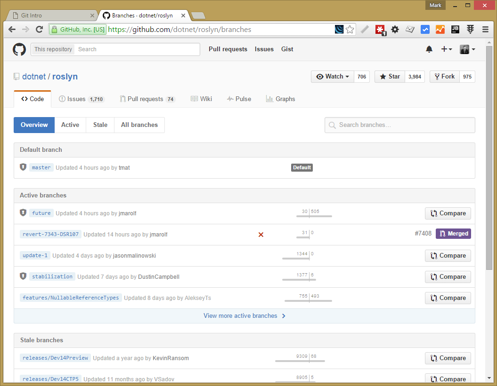
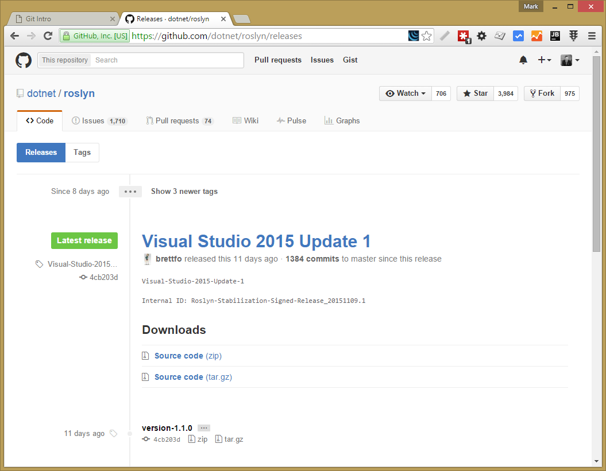
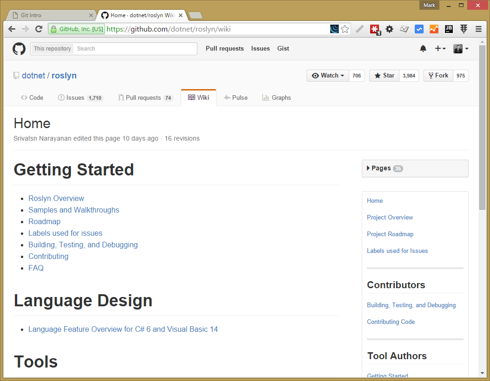
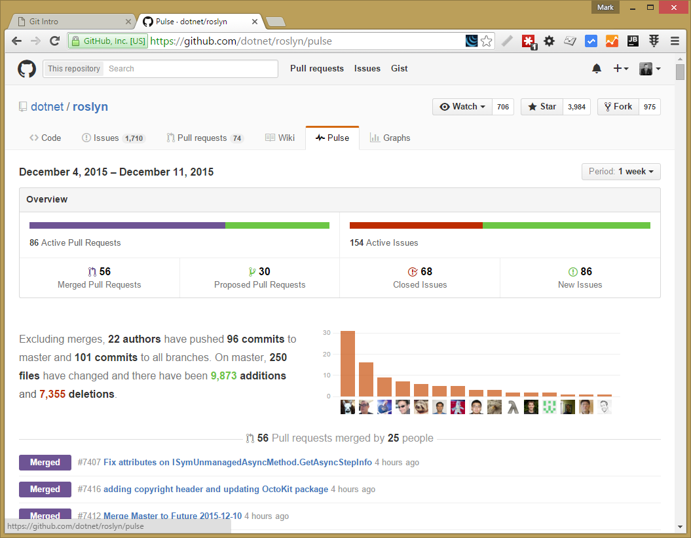
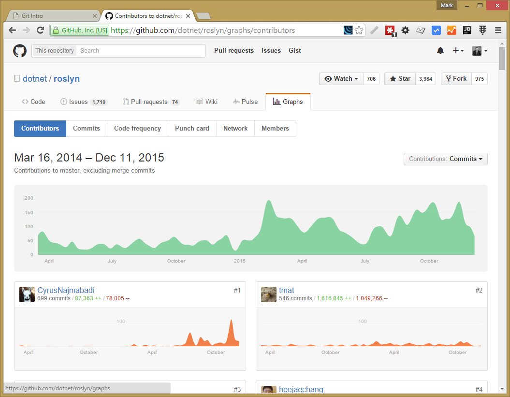
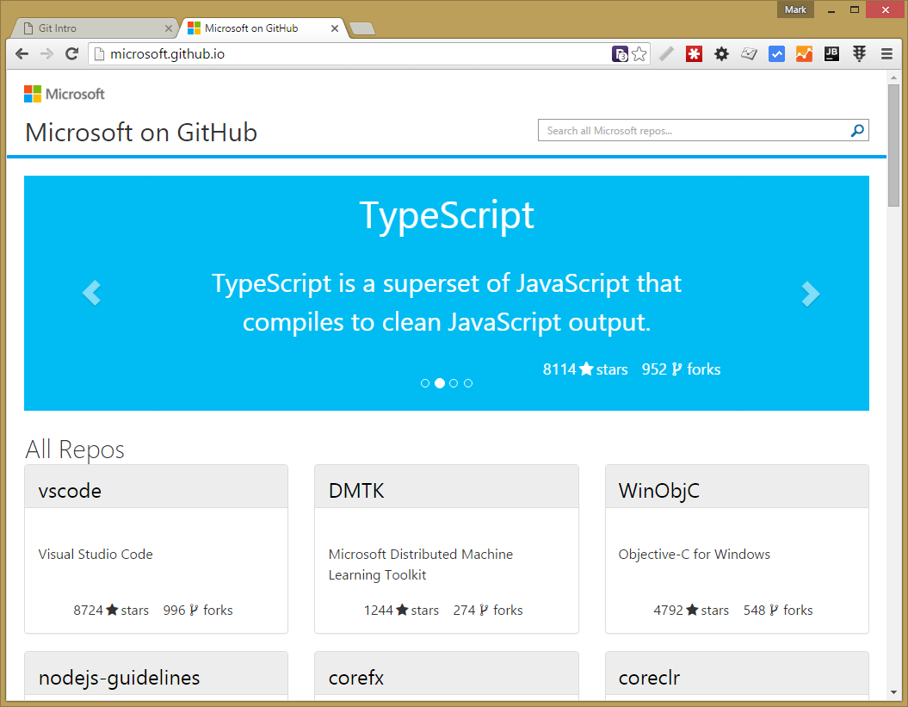
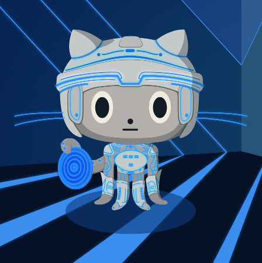
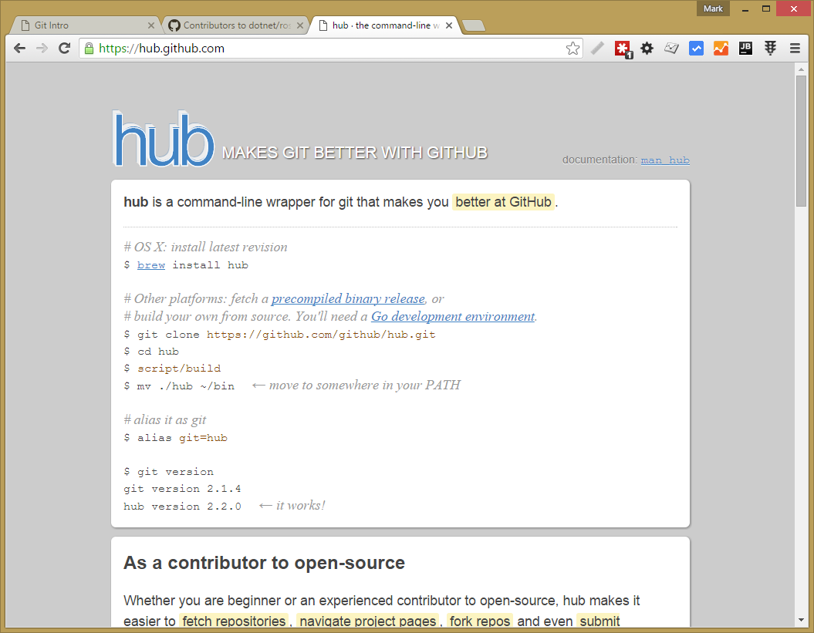

- title : Git Intro
- description : Introduction to Git SCM
- author : Mark Broadhurst
- theme : night
- transition : default

***

# GitHub

***

## Code Page

***

***

## Branches

***

***

## Releases

***

***

## Forks

***

## Pull Requests

***

***

## Wiki

***

***

## Pulse

***

***

## Graphs

***

***

## GitHub Pages

***

***

## Hub.exe

***

***

***
